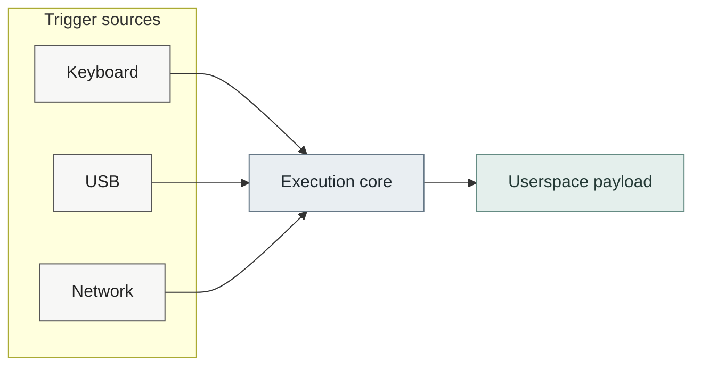
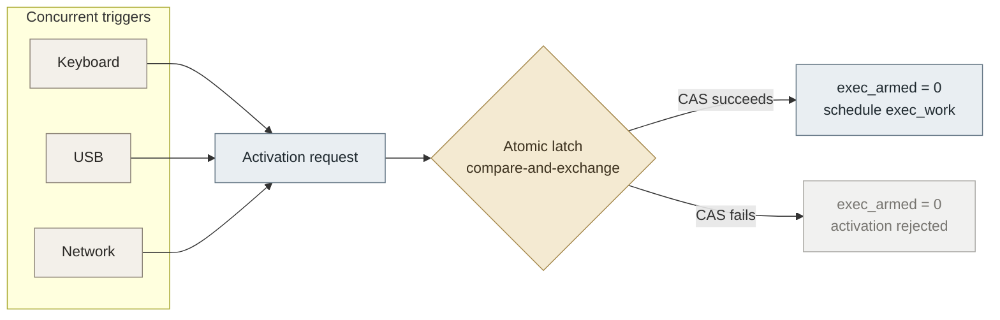
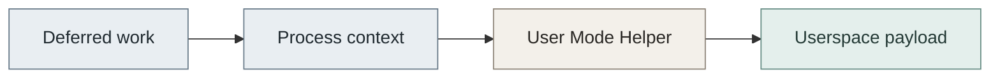
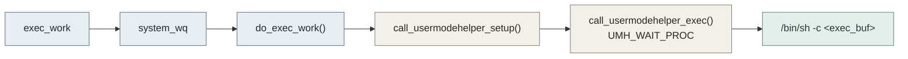

# Development guide

This document explains how **`wrong8007`** is structured internally and how to extend it by contributing new triggers in a maintainable way.

It assumes familiarity with:

- Linux kernel development
- Loadable Kernel Modules (LKM)
- Kernel-level event and interception mechanisms, including notifier chains, Netfilter and USB device notifications
- Project's [design philosophy](manifesto.md) and [security model](security-model.md).

Payload behavior and data-destruction strategies are intentionally outside the scope of this document. See [Data destruction & Wiping rationale](dd.md) for discussion of those topics.

PRs that violate the project's execution model, trust boundaries, lifecycle and safety guarantees will not be accepted.

## Architecture

Wrong Boot follows a small core, pluggable trigger architecture.



The core owns execution and lifecycle management. Triggers are independent event sources that detect conditions and request activation through a single core-owned interface.

This separation keeps individual triggers focused while allowing the execution model to evolve independently.

### Responsibilities of the core

The core module (`wrong8007.c`) is responsible for:

* Validating and storing core module parameters
* Initializing and tearing down registered triggers
* Maintaining the global execution state
* Arbitrating competing trigger activations
* Scheduling deferred execution through `exec_work`
* Invoking the configured userspace command through the [User Mode Helper API](https://www.kernel.org/doc/html/v4.13/core-api/kernel-api.html#c.call_usermodehelper_exec)
* Rolling back trigger initialization if module loading fails
* Flushing pending execution work during module unload

### Responsibilities of triggers

Each trigger is responsible for:

* Registering with the relevant kernel subsystem
* Validating trigger-specific configuration
* Maintaining any state required to detect its condition
* Evaluating incoming events
* Calling `wrong8007_activate()` when its condition is satisfied
* Unregistering its hooks and freeing its state during teardown

A trigger **must not own execution policy**.

In particular, triggers must not:

* Call `schedule_work(&exec_work)`
* Call `call_usermodehelper()` directly
* Execute the configured payload themselves
* Modify the global execution latch
* Depend on another trigger being enabled

The core is the sole owner of execution arbitration and deferred execution.

## Trigger interface

All triggers must expose a `struct wrong8007_trigger`:

```c
struct wrong8007_trigger {
    const char *name;
    int (*init)(void);
    void (*exit)(void);
};
```

> The interface intentionally contains only initialization and teardown operations. Runtime activation is performed through the core's `wrong8007_activate()` function.

### Trigger lifecycle

A trigger's `init()` function should:

1. Validate its configuration.
2. Allocate and initialize any required state.
3. Register its kernel hooks or notifiers.
4. Return `0` only when the trigger is ready for use.

A non-zero return value means initialization failed.

The core treats trigger initialization failure as a module-load failure and rolls back previously initialized triggers.

A trigger's `exit()` function should:

1. Unregister its kernel hooks/notifiers.
2. Stop or delete timers and other asynchronous sources.
3. Free trigger-owned memory.
4. Leave no active callback pointing at module-owned state.

`exit()` must be safe for the lifecycle state actually reached by `init()`.

## Activation and one-shot execution

Triggers do **not** schedule the execution work directly.

When a trigger detects its configured condition, it calls:

```c
wrong8007_activate();
```

The core owns the activation decision and uses an atomic execution latch:

```c
void wrong8007_activate(void)
{
    if (atomic_cmpxchg(&exec_armed, 1, 0) == 1)
        schedule_work(&exec_work);
}
```

This provides the module's one-shot guarantee.

### First trigger wins

The module starts armed:

```text
exec_armed = 1
```

All triggers converge on the same activation path. The first caller atomically consumes the latch and schedules the work; concurrent or subsequent callers are rejected.



The latch is therefore owned by the core rather than by individual trigger implementations. Multiple triggers may request activation concurrently, but only one can consume the execution latch.

## Deferred execution

Trigger callbacks may run in interrupt, atomic, notifier, or softirq-related contexts where sleeping and userspace process creation are not appropriate.

Triggers therefore only request activation:

```c
wrong8007_activate();
```

Once activation has been accepted, execution is deferred to the core's work item:



The work item runs in process context on the kernel's system workqueue, allowing the execution path to perform operations that are not appropriate from trigger callbacks.

The configured payload is therefore **never executed directly from a trigger callback**.

### User-mode execution

The core invokes the configured command through `/bin/sh`:



The environment is intentionally minimal:

```bash
HOME=/
PATH=/sbin:/bin:/usr/sbin:/usr/bin
```

The User Mode Helper invocation uses `UMH_WAIT_PROC`, so the kernel worker executing `exec_work` waits for the userspace command to finish.

> [!CAUTION]
> This has an important operational consequence: a payload that never terminates can keep the execution work item running indefinitely.

## Module lifecycle

### Load

During module initialization, the core:

1. Validates and copies the configured execution command.
2. Initializes the execution latch to the armed state.
3. Initializes each registered trigger in sequence.
4. Aborts loading if any trigger fails.

If a trigger fails to initialize, previously initialized triggers are torn down and allocated state is released before module initialization returns an error.

This provides a fail-closed initialization path: the module does not remain partially active when it cannot initialize all requested components.

### Runtime

Once initialization succeeds, triggers wait for events from their respective kernel subsystems.

Triggers may maintain internal state when necessary. For example:

* The keyboard trigger maintains phrase-matching state
* The network trigger maintains heartbeat timing state
* USB maintains parsed device rules

The trigger framework is therefore **not strictly stateless**. The important architectural property is that trigger state remains local to the trigger and does not control execution policy.

### Unload

During module removal, the core:

1. Calls each trigger's `exit()` function.
2. Unregisters trigger hooks and stops asynchronous trigger activity.
3. Flushes `exec_work`.
4. Frees core-owned memory.

`flush_work(&exec_work)` waits for an already-running execution work item to finish.

Consequently, unloading the module while the configured payload is still running can block until that payload exits.

## Designing a new trigger

### 1. Create the trigger source

Location:

```
trigger/<your_trigger>.c
```

Include only what you need:

```c
#include <linux/module.h>
#include <wrong8007.h>
```

### 2. Implement initialization and teardown

```c
static int trigger_example_init(void)
{
    wb_info("example trigger initialized\n");
    return 0;
}

static void trigger_example_exit(void)
{
    wb_info("example trigger exited\n");
}
```

Initialization should not report success until all resources required by the trigger have been successfully established.

### 3. Implement event detection

A runtime callback should detect its condition and request activation through the core:

```c
if (condition_matches)
    wrong8007_activate();
```

Do **not** call:

```c
schedule_work(&exec_work);
```

from the trigger.

Do **not** call:

```c
call_usermodehelper(...);
```

from the trigger.

The trigger only reports that its condition has been met.

### 4. Expose the trigger

```c
struct wrong8007_trigger example_trigger = {
    .name = "example",
    .init = trigger_example_init,
    .exit = trigger_example_exit
};
```

### 5. Register the trigger with the core

Add the trigger to the core's trigger list:

```c
extern struct wrong8007_trigger example_trigger;

static struct wrong8007_trigger *triggers[] = {
    &keyboard_trigger,
    &usb_trigger,
    &network_trigger,
    &example_trigger,
};
```

The core then owns the trigger's initialization and teardown as part of the module lifecycle.

## Parameter handling

Triggers may define module parameters, but must follow these rules:

* Validate trigger-specific parameters during `init()`.
* Return an error for invalid configuration.
* Do not silently reinterpret malformed configuration.
* Prefer strict parsing over permissive behavior.
* Allocate derived state during initialization rather than repeatedly parsing configuration in hot paths.
* Release all trigger-owned allocations during teardown.

Example:

```c
if (!param || !*param)
    return -EINVAL;
```

## Memory and context rules

Trigger callbacks may execute in contexts where sleeping is forbidden.

Trigger implementations must therefore:

* Avoid sleeping in atomic or interrupt context
* Avoid operations that may block from hot-path callbacks
* Avoid unnecessary dynamic allocation in event callbacks
* Keep callback work small
* Defer process-context work to the core
* Free trigger-owned allocations during teardown
* Ensure asynchronous callbacks cannot access freed state after `exit()` returns

If a trigger requires substantial processing or a blocking operation, it should introduce an appropriate deferred mechanism rather than performing that work directly in the event callback.

## Logging guidelines

Use the project's logging macros consistently:

| Macro     | Usage                                               |
| --------- | --------------------------------------------------- |
| `wb_dbg`  | Development and diagnostic output                   |
| `wb_info` | Informational initialization and lifecycle messages |
| `wb_warn` | Recoverable or potentially unsafe conditions        |
| `wb_err`  | Initialization or runtime errors                    |

Logging is not guaranteed to stop after activation.

The execution path itself records the result of the userspace helper after it returns and debug logging may expose additional trigger or execution information.

Avoid logging sensitive configuration values unless there is a clear debugging reason to do so.

## Testing new triggers

Recommended workflow:

1. Build the module.
2. Load it with only the new trigger enabled, preferably.
3. Verify successful initialization.
4. Verify invalid configuration causes initialization failure.
5. Verify `exit()` unregisters all resources cleanly.
6. Test activation in isolation.
7. Test concurrent activation with another trigger.
8. Validate module removal with `rmmod`.
9. Verify repeated and concurrent activation attempts preserve one-shot behavior.
10. Combine the new trigger with existing triggers only after its isolated behavior is understood.

A trigger should be tested both for the condition that activates it and for the conditions that must **not** activate it.

## Code style

Follow Linux kernel coding conventions.

Prefer:

* Well-defined ownership
* Clear control flow
* Strict validation
* No coupling between triggers
* Comments for non-obvious kernel behavior

If a trigger is hard to reason about in isolation, it is not ready to be included yet.

## Design constraints for contributors

New triggers must preserve the core execution model:

- The trigger decides _whether its own condition has occurred_.
- The core decides _whether execution is still armed and how execution is performed_.

That separation is the central architectural contract of the project.

## Trigger-specific notes

### USB trigger

USB device rules are parsed once during module initialization rather than in the notifier callback.

This keeps the notifier callback focused solely on event matching and ensures invalid configurations fail before any USB notifier is registered.

If no rules are configured, the USB trigger remains inactive and does not register a notifier.
