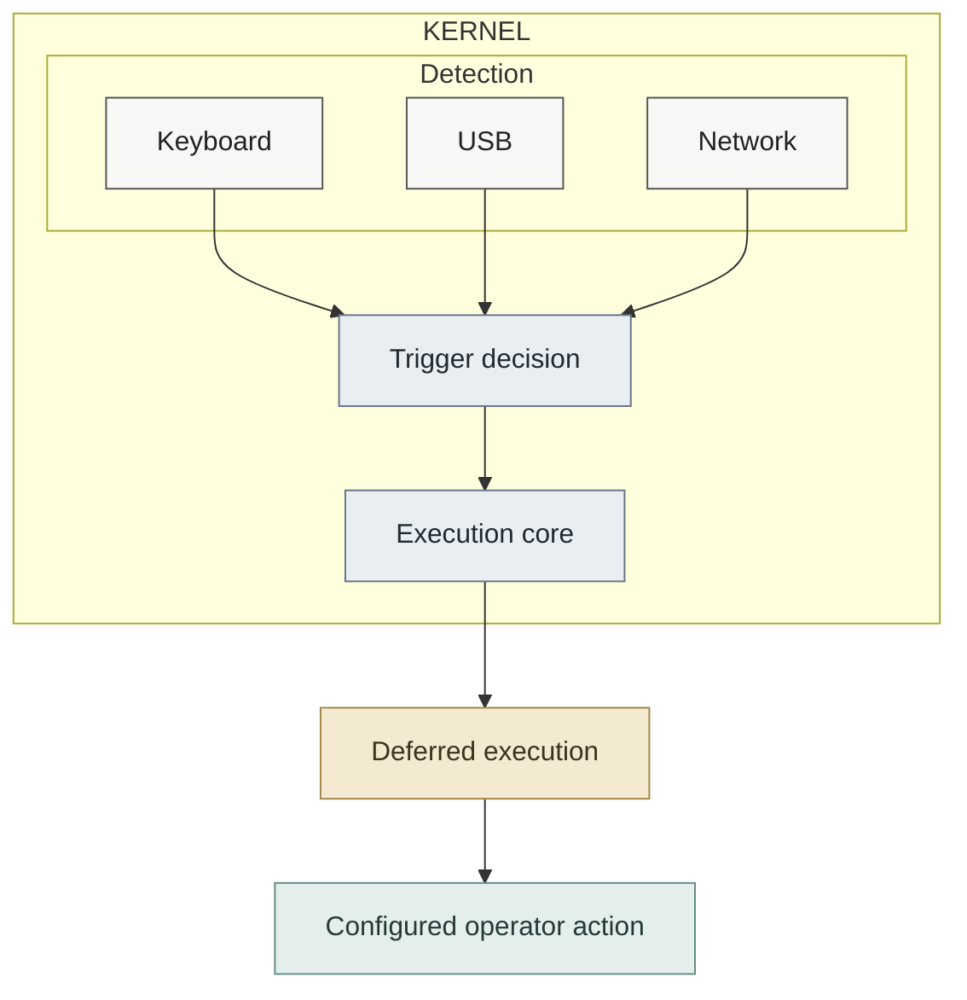

# Design philosophy

Wrong Boot is built around a simple observation:

> **Some decisions are better made before the system reaches the point where it's too late to make them.**

When control of a system is threatened, there may be no opportunity to stop and decide what to do next. The outcome depends on the decisions made beforehand.

The goal is not to predict every failure. It is to have a response ready when one matters.

Everything else in this project follows from that premise.

## The kernel is the trust boundary

Wrong Boot chooses the kernel as its event-detection and enforcement boundary because the events it cares about can occur before reliable user-space response is possible.

User space may be:

* Unavailable,
* Compromised,
* Misconfigured,
* Intentionally stopped or
* Simply too late to respond.

For that reason, trigger detection lives entirely in kernel space and relies on existing kernel subsystems rather than long-running daemons or polling loops.

This does **not** mean that the kernel is assumed to be universally trustworthy or that kernel-space execution is inherently secure.

It means that Wrong Boot deliberately chooses where its enforcement boundary lies and minimizes dependencies outside that boundary.

The boundary is asymmetric:

The kernel provides the detection and execution mechanism. The configured action crosses back into user space deliberately.

This boundary and its consequences and limitations are described in more detail in [security-model.md](security-model.md).

## Detection and execution are different concerns

Triggers answer exactly one question:

> **Has a condition been met?**

They do not decide:

- What should happen,
- When it should happen,
- Whether another trigger should win,
- Whether execution remains available.

Those responsibilities belong exclusively to the core.

Keeping triggers detection-only makes them easier to understand, audit and extend without affecting execution behavior.

The implementation details of this model, including the activation latch and workqueue execution path belong in [development.md](development.md).

## Fail closed

Wrong Boot prefers refusing to operate over silently accepting ambiguous, incomplete or partially valid configurations.

Configuration is therefore validated before the module becomes active and trigger initialization is treated as part of the module's overall readiness.

If the module cannot establish the conditions required for its configured operation, it should not silently continue with only part of that configuration active.

This principle exists because a partially functioning trigger system can create a false sense of protection or predictability.

Fail-closed behavior does not mean that _every_ runtime failure can be prevented. It simply means that known initialization failures should not be converted into apparently successful operation.

## Predictability over cleverness

Wrong Boot rewards designs that are easy to reason about.

The project therefore favors:

* Clear ownership
* Clean state transitions
* Strict configuration
* Nominal coupling
* Straightforward control flow
* Well-defined lifecycle behavior

_over code that is clever, opaque, tightly coupled or unnecessarily generalized._

This principle applies especially strongly to trigger implementations. A trigger should make it obvious what event it observes, what condition it evaluates and when it requests activation.

## Nominal assumptions

Wrong Boot should depend on as few assumptions about the surrounding system as practical.

A trigger should not require a particular user-space daemon to be running merely to observe the event it was designed to detect.

Likewise, the core should not depend on individual triggers understanding or coordinating with one another.

Reducing assumptions makes the execution model easier to reason about and reduces the number of external components that can silently change its behavior.

This does not imply that Wrong Boot has no dependencies or limitations. Kernel APIs, subsystem behavior, module-loading policy, hardware, configuration and user-space execution all impose constraints.

The principle is instead to make those dependencies clear-cut rather than hiding them behind implicit assumptions.

## Extensibility without coupling

Supporting a new event source should require implementing only that trigger.

Existing triggers should not need to change.

Likewise, changes to execution policy should not require modifying trigger implementations.

This separation allows the project to grow without increasing coupling.

The specific trigger interface, lifecycle contract and contributor requirements are documented in [development.md](development.md).

## The operator decides

Wrong Boot does not prescribe what the configured action should accomplish. It defines **when** execution may occur, not **what** the operator ultimately chooses to execute.

Whether the configured action archives evidence, sends an alert, locks a system, initiate a recovery procedure, destroys data, or performs something entirely different is outside the module's scope.

> _The project provides the mechanism. The operator defines the policy._

This separation also prevents trigger implementations from becoming coupled to a particular operational purpose.

## A deliberate boundary between mechanism and consequence

Wrong Boot's architectural decisions should be evaluated independently from the consequences of a particular payload.

The trigger system determines whether a predefined condition has occurred.

The core determines whether execution is still available and how it is dispatched.

The configured action determines what happens afterward.

This keeps the trigger and execution logic independent from the purpose of the payload, making each part easier to reason about and verify.

For payload-specific behavior and data-destruction considerations, see [dd.md](dd.md).

## What this means for contributors

The implementation _may change_. The design constraints _should not_.

When changing Wrong Boot, keep these boundaries intact:

* **Decide before the incident.** If an event matters, detect it where it can still be observed and acted on.
* **Keep detection and execution separate.** Triggers report conditions, the core owns execution.
* **Keep execution policy centralized.** New triggers should not implement their own execution paths.
* **Fail closed.** If a trigger cannot establish the resources it needs, initialization should fail rather than leave a partially working trigger behind.
* **Keep it simple, stupid.** Prefer simple control flow and predictable behavior.
* **Limit assumptions.** A trigger should depend only on what it actually needs from the surrounding system.
* **Keep triggers independent.** Adding one trigger should not require changes to unrelated triggers.
* **Leave the action to the operator.** Wrong Boot provides the mechanism, the configured payload determines what happens.

These are the questions to ask when reviewing a change:

1. Does it preserve these boundaries?
2. Does it introduce new assumptions or coupling?
3. Does it make failure or execution behavior harder to reason about?

The implementation rules and extension details are documented in [development.md](https://github.com/0x48piraj/wrong8007/blob/master/docs/development.md).
