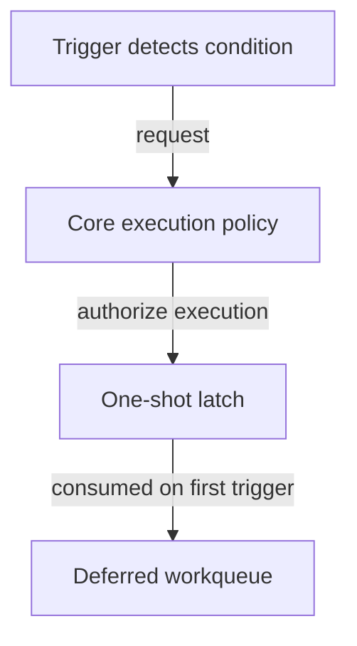

# Design philosophy

Wrong Boot is built around a simple observation:

> **The decision that matters most is often the one made before an incident begins.**

When control of a system is threatened, there may be no opportunity to stop and decide what to do next. The outcome depends on the decisions made beforehand.

Everything else in this project follows from that premise.

## The kernel is the trust boundary

Wrong Boot assumes user space may become unavailable, compromised, or simply too late.

For that reason, trigger detection lives entirely in kernel space and relies on existing kernel subsystems rather than long-running daemons or polling loops.

Execution is intentionally deferred through the kernel workqueue API so that trigger callbacks remain lightweight and execute only in contexts where user-space execution is permitted.

## Architecture

Wrong Boot follows a small core, pluggable trigger architecture.

Every trigger is responsible only for detecting a condition.

The core owns everything that happens afterwards, including execution policy, lifecycle management and coordination between triggers.

This separation keeps individual triggers focused while allowing the execution model to evolve independently.

<p align="center">
  
</p>

### Separation of responsibilities

Triggers answer exactly one question:

> **Has a condition been met?**

They do not decide:

- What should happen,
- When it should happen,
- Whether another trigger should win.

Those responsibilities belong exclusively to the core.

Keeping triggers detection-only makes them easier to understand, audit and extend without affecting execution behavior.

### One interface, many triggers

Every trigger communicates with the core through the same public interface:

```c
wrong8007_activate();
```

A trigger never executes user-space code directly.

Instead, it requests execution and immediately returns. Whether execution proceeds is entirely the responsibility of the core.

This stable interface keeps trigger implementations independent of execution policy and minimizes coupling between components.

### Ownership and coordination

Execution is intentionally one-shot.

Multiple trigger types may be active simultaneously, but the first trigger that satisfies its condition is the only one that can request execution successfully.

Internally, this is implemented as an execution latch.



This model centralizes ownership inside the core while allowing every trigger to remain completely independent.

As a result:

- Execution occurs at most once.
- Competing triggers cannot race one another.
- Execution policy is implemented in one place.
- Triggers remain unaware of one another.
- New trigger types can be introduced without changing execution logic.

### Extensibility

Supporting a new event source should require implementing only that trigger.

Existing triggers should not need to change.

Likewise, changes to execution policy should not require modifying trigger implementations.

This separation allows the project to grow without increasing coupling.

## Engineering principles

### Fail closed

Configuration is validated before the module becomes active.

Invalid parameters prevent the module from loading.

Wrong Boot prefers refusing to operate over silently accepting ambiguous, incomplete or partially valid configurations.

### Predictability over cleverness

Kernel code rewards simplicity.

Clear ownership, clean state transitions and simple control flow are preferred over clever algorithms or tightly coupled designs.

The project intentionally favors code that is easy to reason about over code that is merely concise.

## The operator decides

Wrong Boot does not prescribe a payload.

It defines **when** execution occurs, never **what** execution should do.

Whether the configured action archives evidence, sends an alert, locks a system, destroys data, or performs something entirely different is outside the module's scope.

The project provides the mechanism. The operator defines the policy.
