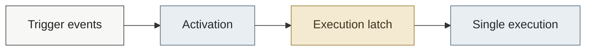

# Security model

This document describes the **security consequences, trust boundaries, guarantees and limitations** of project's design.

It exists to prevent ambiguity, misuse and incorrect assumptions by users, auditors and contributors.

For architectural context, see [design philosophy](manifesto.md). For implementation details, see [development guide](development.md).

## Threat model

Wrong Boot is designed for systems where the operator has control of the machine before an incident occurs and wants a pre-configured response to remain available even when normal user-space mechanisms may no longer be reliable.

The model assumes:

* The operator can load and configure the kernel module before the relevant incident,
* The kernel is trusted at the time the module is loaded,
* The configured action is intentionally chosen by the operator,
* Trigger inputs such as keyboard events, USB events and network traffic may originate from untrusted sources,
* User-space processes may become unavailable, compromised or too late to respond,
* The system may become physically or logically hostile after activation.

The model does **not** assume that Wrong Boot can remain secure against an attacker who already controls the kernel.

## Trust boundaries

### Kernel

The running kernel is the primary trust root for Wrong Boot.

The module relies on kernel facilities including:

* Kernel notifier mechanisms
* USB subsystem notifications
* Netfilter
* Kernel timers
* Workqueues
* User Mode Helper

If an attacker can arbitrarily modify or control the running kernel, the security properties described by this document can no longer be relied upon.

A kernel-level attacker can potentially:

* Unload or disable the module
* Modify the module's state
* Prevent trigger callbacks from executing
* Intercept or alter activation requests
* Modify the configured execution state
* Replace or interfere with the execution mechanism
* Observe or alter kernel-resident configuration

Wrong boot therefore provides no meaningful protection against an _already-compromised_ kernel.

### User space

Wrong Boot does not depend on a user-space daemon to remain alive to observe trigger events.

Detection and activation happen at the kernel boundary. The configured action is then deliberately handed back to user space.

This creates an asymmetric boundary. The kernel is used to preserve the ability to **detect and authorize** the response, while the consequence of that response is intentionally delegated to the configured user-space command.

The activation latch and deferred execution path are implementation details covered in [development.md](development.md).

### External inputs

Keyboard activity, USB events and network traffic are treated as external inputs rather than trusted configuration.

A trigger should therefore only act on an input according to its configured matching rules.

An external event does not gain additional privileges merely by causing a trigger to activate.

## Privileges

Loading the module requires the privileges necessary to load a kernel module on the target system, typically including `CAP_SYS_MODULE` where module loading is permitted.

This requirement is intentional.

Wrong Boot is not a privilege-escalation mechanism. It assumes the operator already has sufficient control of the system to install and configure kernel code.

Once loaded, the module executes in kernel context and its configured user-space action is invoked through the kernel's User Mode Helper mechanism.

The resulting action therefore runs with the privileges available to that execution path, rather than with the restricted privileges of an ordinary unprivileged application.

The configured action should consequently be treated as a **high-privilege operation**.

## Kernel/user-space execution boundary

Trigger detection occurs at the kernel boundary. When a trigger condition is satisfied, the core decides whether execution should proceed and defers the configured action out of the trigger context.

The action is then handed back to user space through the kernel's User Mode Helper mechanism.

This creates an intentional asymmetry:

* **Detection and activation** are handled by the kernel.
* **The configured consequence** is executed in user space.

The configured action therefore inherits the privileges and execution environment of the User Mode Helper path and should be treated as a high-privilege operation.

The activation latch and deferred execution mechanics are described in [development.md](development.md).

## One-shot execution guarantee

All triggers converge on a single execution latch. At most one activation can consume it, even when multiple triggers activate concurrently.



The result is an **at-most-once execution guarantee**, not a guarantee that every trigger condition will be observed.

The atomic latch and execution path are described in [development.md](development.md).

## Interception position

Wrong Boot observes trigger events through kernel mechanisms rather than relying on a persistent user-space process to report them.

This means stopping or modifying the user-space application that would normally consume an event does not necessarily prevent the kernel trigger from observing it.

The exact visibility and ordering of an event depend on the subsystem and hook used by the trigger. A kernel-level attacker remains outside the protection model.

## Configuration exposure

Module parameters are not secret storage.

Configuration supplied to the module may be exposed through kernel mechanisms such as:

```text
/sys/module/wrong8007/parameters/
```

Depending on the parameter and system configuration, values may therefore be observable by privileged or otherwise permitted local processes.

The same principle applies to logging.

Trigger and execution diagnostics may expose operational information through the kernel logging system.

Consequently:

> **A trigger phrase, network matching value, USB rule or configured command should not be treated as confidential merely because it was supplied to the kernel module.**

Operators should avoid treating module parameters as a secure secret-management mechanism.

## Payload security

The project deliberately does not prescribe what the configured action should do.

A payload may record information, notify another system, isolate the machine, start recovery, modify system state, destroy information, or perform another operator-defined action.

The module therefore cannot guarantee that a payload is safe.

The payload inherits the privileges and execution context of the User Mode Helper path and may have consequences far beyond the trigger itself.

In particular, a malicious, accidental or poorly tested command can cause significant system impact.

## Module unload and payload lifetime

The configured action is not detached from the module's lifecycle.

Because the execution work uses `UMH_WAIT_PROC`, the work item remains active while the spawned user-space command is running.

During module removal, the core flushes the execution work:

```c
flush_work(&exec_work);
```

Therefore, removing the module while its configured action is still executing can block until that action terminates.

This is an operational consequence of the execution model rather than a separate recovery mechanism.

Operators should test payload termination behavior before relying on module removal as part of an incident-response procedure.

## Guarantees and limitations

Wrong Boot provides architectural guarantees, but its behavior still depends on the kernel, the surrounding system and the configured payload.

### Architectural guarantees

The design provides:

* Centralized activation arbitration
* At-most-once execution
* Separation between trigger detection and execution
* Fail-closed initialization
* Deferred execution from trigger contexts

### Environment-dependent behavior

The following remain dependent on the surrounding system:

* Successful trigger observation
* Availability of the required kernel subsystems
* Successful module loading
* User-space process creation
* Availability of `/bin/sh` and other execution components
* Completion of the configured payload

### Outside the model

Wrong Boot does not protect against:

* A compromised or untrusted kernel
* Failure to load the module before an incident
* Incorrect trigger or payload configuration
* Runtime failure of the underlying trigger subsystem
* Failure or unintended behavior of the configured payload
* Physical loss, destruction, or power-off of the machine
* Confidentiality loss of module parameters or diagnostic information
* General system-security failures outside the module's scope

Wrong Boot is not a replacement for system hardening, access control, monitoring, or incident response.

## Non-goals

Wrong Boot is not intended to:

* Escalate privileges
* Install itself without operator action
* Conceal its presence from the system owner
* Provide persistence against deliberate removal
* Defeat a trusted or compromised kernel
* Act as a general security-monitoring framework
* Guarantee that an arbitrary payload is safe
* Modify kernel memory outside its own scope
* Replace normal system hardening, access control, monitoring or incident-response mechanisms

If you are looking for covert channels, or evasion techniques, this project is **not for you**.

## Operational and ethical boundary

Wrong Boot is intended for systems the operator owns or is explicitly authorized to control.

The module provides a mechanism for pre-configured detection and response. The operator remains responsible for:

* Choosing appropriate trigger conditions
* Protecting access to the module and its configuration
* Testing the configured payload
* Understanding its consequences
* Complying with applicable laws, policies, and organizational controls

The authors make **no claim** that this tool is suitable for offensive, covert, or unauthorized use. Using it to damage systems you don't own or have permission to modify is illegal.
